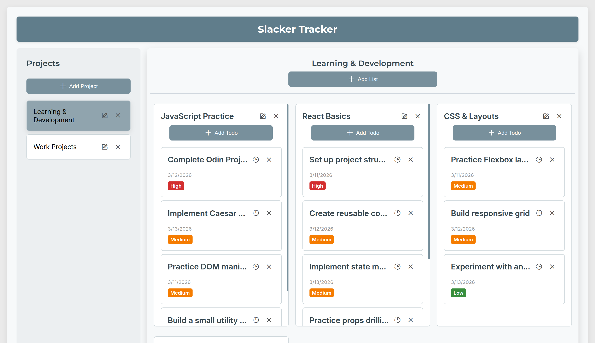
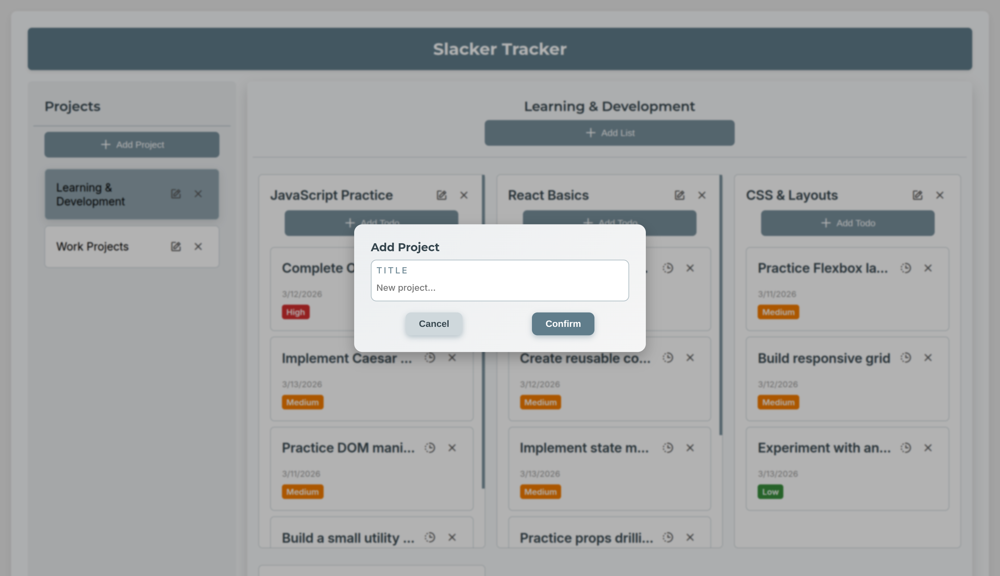
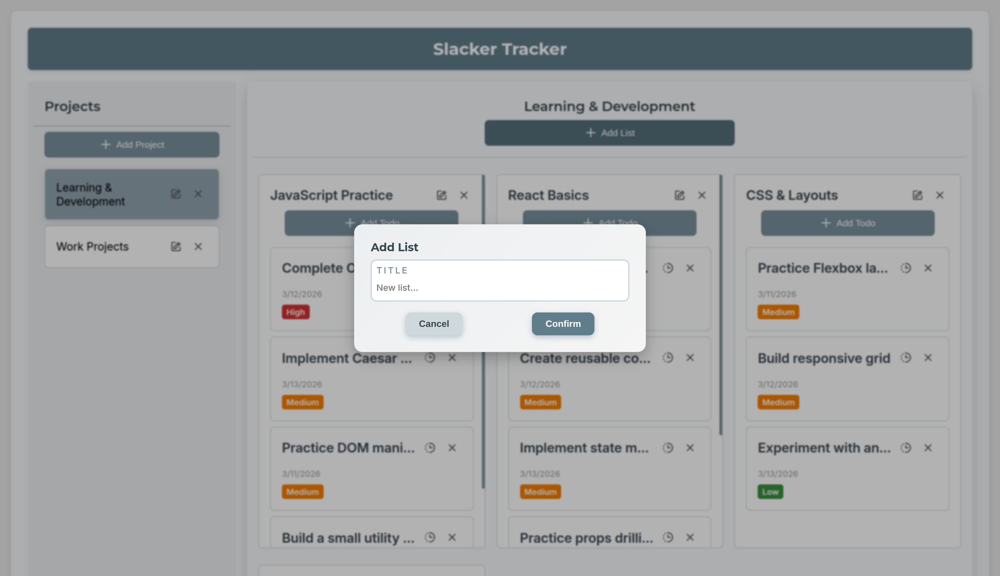
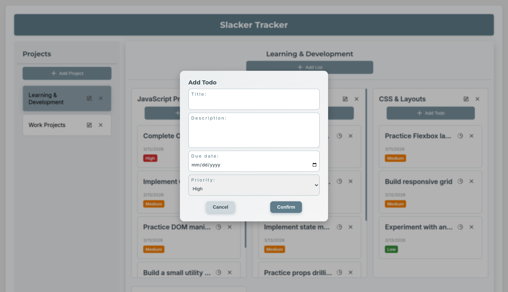

#  Project: Slacker Tracker

## Overview

This **Todo** application, built as part of [The Odin Project](https://www.theodinproject.com/) curriculum, is implemented using **vanilla JavaScript** and follows a modular architecture inspired by the **Model–View–Controller (MVC)** pattern. The goal of the project is to practice separation of concerns, maintainable structure, and state-driven UI updates without relying on frameworks. The app stores all projects, lists, and todos in **localStorage**, ensuring that your data persists across browser sessions.

[Slacker Tracker](https://krig6.github.io/odin-todo/) - Track your tasks… or your slacking.

## Screenshots

## Technologies Used

- **HTML5** – Semantic markup for structured content.
- **CSS3 / Flexbox & Grid** – Responsive layouts and card styling.
- **JavaScript (ES6+)** – Dynamic DOM manipulation and state handling.
- **Boxicons** – Icons for buttons, priorities, and actions.
- **Dialog `<dialog>` element** – Modals for adding projects, lists, and todos.
- **LocalStorage** – Persistent storage across browser sessions.
- **Google Fonts** – Inter for body text and Montserrat for headings.
- **Animations & Transitions** – Hover effects, card lifts, button transitions, and subtle shake animations.
- **Favicon (.png)**

## Features

- **Project Management** – Create, view, and select multiple projects. Each project contains its own lists and todos.
- **List Management** – Add, edit, and delete lists within a project. Lists act as categories for your todos.
- **Todo Items** – Create todos with:
  - **Title**
  - **Description**
  - **Due date**
  - **Priority**: High, Medium, Low (color-coded: red, orange, green)
  - **Status**: Mark as completed or in progress, with hover tooltip showing current status.
- **Todo Sorting** – Sort todos using a dropdown menu for better task organization. Completed todos are automatically kept at the bottom.
- **Due Date Indicators** – Overdue todos are visually highlighted to help users quickly identify tasks that need attention.
- **Persistent Storage** – All projects, lists, and todos are stored in **localStorage**, so data persists across browser sessions.
- **Modals & Forms** – Add or edit projects, lists, and todos via accessible, animated dialog modals.
- **Toast Notifications** – Global toast messages provide feedback for actions such as creating or deleting items.
- **Tooltips** – Buttons and status indicators display helpful hover tooltips.
- **Responsive Layout** – Works on mobile and desktop using **Flexbox** and **CSS Grid**.
- **Interactive UI** – Hover effects and subtle card lifts for projects, lists, and todos.
- **Animations** – Buttons shake or lift on hover for visual feedback.
- **Iconography** – Boxicons used for buttons, priorities, and actions.
- **Accessibility Enhancements** – Clear focus states, large click/tap targets, and labels for forms.

## Learning Path

Building this **Todo** app felt like following a small roadmap for myself. I wanted to try using the *MVC pattern*, so I started with the models, then controllers, and finally the views. I’m still learning, but having this structure made it easier to see how the pieces fit together, even if I sometimes had to backtrack or rethink things.

Styling for different screen sizes was an interesting challenge. In my [Odin Restaurant Page](https://krig6.github.io/odin-restaurant/) project for The Odin Project, I had to write a lot of media queries, which was quite tedious and tricky to manage. For this Todo List project, I tried a **mobile-first approach** again — my second time after the [Odin Warrior Homepage](https://krig6.github.io/odin-warrior-homepage/) — and it really proved to be easier. I only needed a few media queries to support larger screens, which made styling feel much simpler and more manageable.

Overall, this project was a practical attempt at applying the MVC pattern, building models, controllers, and views to organize the code. It helped me gradually build confidence in structuring a project and styling the UI. It’s far from perfect, but it’s a step forward in making a functional and maintainable Todo app.

## Future Enhancements

- **Drag-and-Drop Todo Reordering** – Allow users to rearrange todos within a list using drag-and-drop for better task organization.
- **Due Date Reminders** – Add notifications or visual cues for upcoming or overdue tasks.
- **Search and Filter** – Implement searching and filtering todos by title, priority, or due date.
- **Theme Support** – Light/dark mode toggle to improve usability and aesthetics.
- **Export/Import Data** – Enable exporting projects and lists to JSON or CSV, and importing them back.
- **User Authentication** – Allow multiple users with separate projects stored either locally or on a backend.
- **Progress Tracking** – Visual indicators for list or project completion percentages.

## Acknowledgments

### Resource and Tools

- [The Odin Project](https://www.theodinproject.com/) 
- [Neovim](https://neovim.io/) 
- [Google Fonts](https://fonts.google.com/) 
- [Boxicons](https://boxicons.com/) 
- [Flaticon](https://www.flaticon.com/) 
